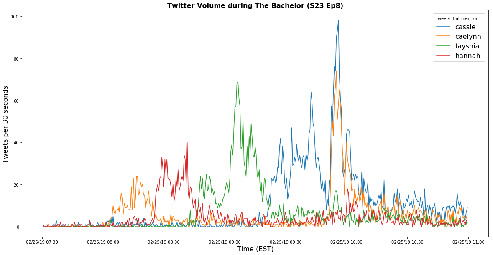

## bachelor-twitter

#### objective
to collect and analyze tweets about the bachelor tv show for fun using Tweepy package and Twitter Streaming API

#### the data collection
- file `collect.py` collects data
`! python collect.py | tqdm  > data.jl`
- tweets were collected on February 25, 2019 from 6:30 PM ET onward
- tweets were filtered on: 
`track = [
        '#bachelor' 
        '#thebachelor',
        '#thebachelorette',
        '#bachelornation',
        '#bachelorabc',
        'colton',
        '#colton',
        'hometowns',
        '#hometowns',
        "#teamhannahg",
        "#teamtayshia",
        "#teamcaelynn",
        "#teamcassie",
    ]`

#### the analysis
- plot of contenstant mentions over time.. Cassie (blue) has the most volume, each spikes during their hometown, Caelynn also spikes during rose ceremony.  Even when Caelynn is being elimanted, people are tweeting more about Cassie than Caelynn. _n=12,960_

- The top used emoji is not the rose 🌹 (which ranked #12 this episode) but the Tears of Joy face 😂, perhaps suggesting Twitter users are watching more for the comedy than the romance? 

- more to come...
